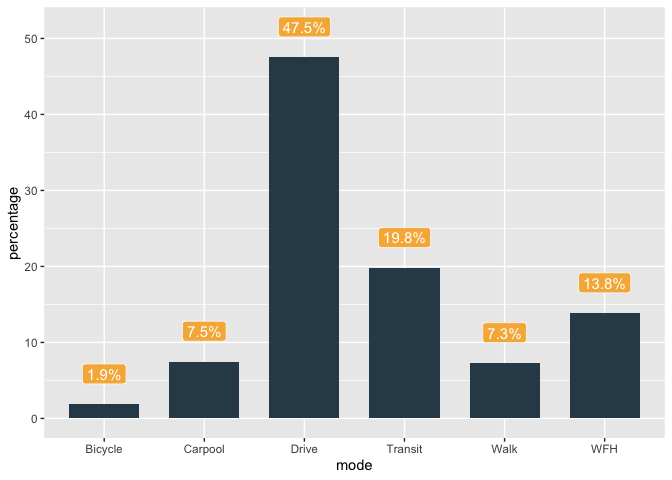

## Introduction

Though unintuitive at first, R offers a powerful way to visualize large data sets. With the right package, you can make charts and maps in R that look equally (if not better) than those you can make in ArcGIS or Illustrator. Most importantly, R is free and open-source and hence allows much smaller organisations (who cannot afford expensive ArcGIS or Adobe license) to leverage the power of GIS. More on ArcGIS and ESRI's monopoly of GIS [here](https://blog.cleverelephant.ca/2018/11/esri-dominates.html). Whenever possible we should challenge the software monopoly of big corporations because:

* It is bad for free market competition—without spending too much time on this, ArcGIS has many flaws as a spatial analysis product that it is not motivated to fix because there is no competition.

* It silos public data in the hands of private corporations, creating a dependency on one organization. Why should ESRI get to monitise data collected by public entities using public tax dollars?

In this document, I hope to show you the basics of data visualizations in R so that you can keep making maps and graphs even after we loose educational ArcGIS and Adobe licenses.

## Basics of ggplot

ggplot is one of the most popular R data visualization packages. ggplot stands for "Grammar of Graphics" and is a way to use language (rather than point and click) to create charts. STHDA has a really good introduction to it [here](https://www.sthda.com/english/wiki/be-awesome-in-ggplot2-a-practical-guide-to-be-highly-effective-r-software-and-data-visualization), but the basic of ggplot is to view it as a collection of layers.

> According to ggplot2 concept, a plot can be divided into different fundamental parts : Plot = data + Aesthetics + Geometry.

> The principal components of every plot can be defined as follow:

> data is a data frame

> Aesthetics is used to indicate x and y variables. It can also be used to control the color, the size or the shape of points, the height of bars, etc…..

> Geometry corresponds to the type of graphics (histogram, box plot, line plot, density plot, dot plot, ….)

You really can do a lot with it! Lets go through the steps of creating a simple bar chart in ggplot.

First, lets set up our environment and call our data. When setting up your data for plotting, remember that the column names appear as the axis labels. Hence, when I set up my pivoted data, I try to use column names that would make the most sense.


``` r
#start by installing the packages
if(!require(pacman)){install.packages("pacman"); library(pacman)}
```

```
## Loading required package: pacman
```

``` r
p_load(tidyverse, ggplot2, sf, tigris, tidycensus)

#call your variables, here I am using commuting statistics from the ACS

commute_vars <- c(
  total_workers = "B08006_001",
  drive_alone = "B08006_003",
  carpool = "B08006_004",
  public_transit = "B08006_008",
  walked = "B08006_015",
  bicycle = "B08006_014",
  worked_at_home = "B08006_017")

philly_commute.2022 <- get_acs(
  geography = "county",
  variables = commute_vars,
  state = "PA",
  county = "Philadelphia",
  year = 2022,
  survey = "acs5",
  output = "wide")%>%
    mutate( #create percentage classes for mapping
    Drive = drive_aloneE/total_workersE * 100,
    Carpool = carpoolE/total_workersE * 100,
    Transit = public_transitE/total_workersE * 100,
    Walk = walkedE/total_workersE * 100, 
    Bicycle = bicycleE/total_workersE * 100,
    WFH = worked_at_homeE/total_workersE * 100
  )%>%
  select(Drive, Carpool, Transit, Walk, Bicycle, WFH) %>%
  pivot_longer( #pivot to a cleaner look for plotting
    cols = everything(),
    names_to = "mode",
    values_to = "percentage"
  )
```

```
## Getting data from the 2018-2022 5-year ACS
```

Lets go over the steps in this chunk. First, I create a vector that stores all the variables that I want from the ACS. Here, the variables are from the B08006 table. In the vector, I also specify the clean variable names I want each data to be associated to. 

Then, I call the 2022 Philadelphia ACS, asking it to extract the variables stored in my vector. After the data has been called, I create new columns that calculate the commute share: here, it is calculated by dividing the estimate of people who Walked to work with the number of total workers. 

Another thing I have to do here is to only select the mode share columns I calculated previously and pivot my table. At the end, my final data set has two columns—a column called Mode that contains the names of the selected commute shares column, and another called Percentage that stores the percentage data. Restructuring our data like so is very important as ggplot needs the data to be clearly structured into X and Y columns.  

Now that our data is set up, let us begin by creating a rough plot. ggplot works by layering objects on top of one another, so we start by specifying the data layer (here being bars of the bar chart).

<!-- -->

Notice that when specifying the aesthetics, I assign the mode column as the X data and percentage column as the Y data. This helps ggplot recognise what data to put where—in the plot above, you see that all the mode names are in the X axis and all the percentage values are in Y axis. Flip it around to see how the data changes. 

You can also use the function coord_flip() to change x and y values. If you do so, you will just need to add coord_flip() to your ggplot call and R handles the rest automatically. X will remain X and Y will remain Y in all instances in your code, but the plot will be flipped. 

Whens specifying the fill colour, you can use either a hex code or a named colour in quotes. R has more than 600 named colours that it recognizes. A list of all such colours can be found [here](https://www.datanovia.com/en/blog/awesome-list-of-657-r-color-names/).

Now that we have our base chart, we can begin our customizations. Lets start by geom_label (or geom_text) which adds text labels to our chart objects.


``` r
plot1+
  geom_text(#sets the text layer on top of the plot
    aes(label = paste0((round(percentage, 1)), "%")),#here, we want the y label to be percentage
    #we use round to make it look pretty
    nudge_y = 3, #we want the text to go up by 4 pixels
  )
```

<!-- -->

Here, I specify the label text to be paste0((round(percentage, 1)), "%")). Lets break this command down:

* paste0(): This function combines all the variables within it to create one string. As the two variables here are the rounded percentage and %, the label would be "[PERCENT]%"
* round(percentage, 1): This rounds the value in the percentage column to 1 decimal place. 

Now, we have our text labels! Stylistically I prefer using the geom_label function instead of geom_text. They are not too different, but geom_label renders text with a filled background which I think look cleaner.


``` r
plot1 <- plot1 +
  geom_label(
    aes(label = paste0((round(percentage,1)), "%")), 
    size = 4, # how big we want it to be
    nudge_y = 4, # move y by 4 px
    fill = "#F6AE2D", #this sets the fill color
    color = "white", #this sets the font color
    alpha = 0.9) #adjusts the transparency to 0.9 from 1, with 1 being fully opaque

plot1
```

<!-- -->

Here, my geom_label command has two arguments that specify the position/size of my labels. Though both of these arguements take numbers, they are slightly different.

* size specifies the font size of the labels. By default, it interprets the input as being in mm. So when I specify size to be 4, I am asking R to make the labels be 4mm. 
* nudge_y tells R where to move the position of the labels relative to the default position. At y = 0, the label will be exactly on the top of the bars. When I specify nudge_y = 4, I am asking R to move the label by 4. Here, 4 is a measure of units in the y axis. If the bar ends at y = 10, a command of nudge_y = 4 would move the label at y = 14. 

The different units used in positioning is tough to wrap your head around, but don't worry, everyone struggles with it! You just get better at remembering it through trial and error.  The rule of thumb to use is that when specifying sizes of anything (dots, lines, fonts), R interprets the numbers as mm and when specifying the position of anywhere (where it is on the plot) R takes in X and Y values. 

Now, lets add more text to our plot, i.e. change the labels using the labs() command.


``` r
plot1 <- plot1 +
    labs( #set the labels for the chart
    title = "How Philadelphia Commutes to Work",
    subtitle = "Percentage by Commute Choice",
    caption = "Data: ACS 2022",
    x = NULL,  # Remove x and y axis label since it is self explanatory
    y = NULL
  ) 

plot1
```

<!-- -->

Usually, labels are placed by default on the top left corner. While you can move it using various commands in the theme(), it can get a bit tricky. More on this below. 

The next thing you will need to do is specify the themes, whichh specify the design of other stylistic chart elements. You can choose between preset R themes, specify your own theme, or do both! There are a lot of themes you can choose from.


``` r
plot1 +
  theme_linedraw()
```

<!-- -->


``` r
plot1 + 
  theme_classic()
```

<!-- -->

Personally, I prefer theme_minimal, so that is what we will use for the plot.


``` r
plot1 <- plot1 +
  theme_minimal()

plot1
```

<!-- -->

Think about preset themes as templates that you can customize. For my plot, I want to change the font as well as the gridlines, which I do so using the theme() function. showtext and sysfonts are two packages that I use to call in new fonts to my R environment. Here, I want to call "IBM Plex Sans" which is a google font using the font_add_google() command. After calling the font, you also have to run the command showtext_auto, which initializes it to the environment. 


``` r
#first, lets call in our packages
p_load(showtext,sysfonts)

#now, lets call in our desired font from google fonts
#here I want to call IBM Plex Sans from google font

font_add_google("IBM Plex Sans") #calls the font
showtext_auto() #initializes it in the environment

plot1 + 
    theme(
    text = element_text(family = "IBM Plex Sans", color = "#2F4858"),
    #sets style for all text
    plot.title = element_text(size = 16, face = "bold"), #adjust formatting of title
    plot.subtitle = element_text(size = 12), 
    axis.text = element_text(size = 11, family = "IBM Plex Sans", color = "#2F4858"))
```

<!-- -->

The theme command gives you quite a lot of freedom to change the elements in your plot! There are dozens of arguements that you can specify in the theme command. You can find a list of all of them [here](https://ggplot2.tidyverse.org/reference/theme.html). I would encourage you to explore it further. 


``` r
plot1 <- plot1 +
    theme_minimal() + #sets a larger theme, google ggplot themes to see the options
  theme(
    text = element_text(family = "IBM Plex Sans", color = "#2F4858"), # set style for
    #all text
    plot.title = element_text(size = 16, face = "bold"), #adjust formatting of title
    plot.subtitle = element_text(size = 12), 
    axis.text = element_text(size = 11, family = "IBM Plex Sans", color = "#2F4858"),
    #set text style for axis text (which is different than plot text, idk why)
    panel.grid.minor = element_blank(), #get rid of minor gridlines
    plot.margin = margin(10, 10, 10, 10), # add padding
    plot.caption = element_text(size = 8, margin = margin(t = 10)), #pad down caption
    panel.grid.major.y = element_line(color = "#F6AE2D", linewidth = 0.3, 
                                      linetype = "dotted"), 
    #have y grids
    panel.grid.major.x = element_blank() #and get rid of x axis grids
  )

plot1
```

<!-- -->

Lets go over the commands that I specify:

* text: Sets the global format style for all text in the plot (except axis text). This modies the titles, subtitles, and caption. Here, I want the font family to be IBM Plex Sans, and the colour to be blue. 
* plot.title and plot.subtitle: Sets the text style for the title and subtitle. I want my title to be bolded, and be of size 16 (mm). This command can also take the arguments hjust or vjust, which specify the position where the title should be relative to the plot. For reference—hjust: 0 (left) to 1 (right). vjust: 0 (bottom) to 1 (top).
* axis.text: The text command however doesn't affect axis text, which is recognized by R to be a different thing. Hence, I specify the format for them here. 
* panel.grid.minor, panel.grid.major.y, panel.grid.major.x: These functions affect the gridlines of the plot. Gridlines are the horizontal and verticles lines we see in the plot. In R, there are major gridlines and minor gridlines. element_blank() makes these gridlines invisible, whereas element_line() helps me specify the formatting of the grid lines. R is a bit weird with gridlines—when it says panel.grid.major.y, it means the lines that are coming out from the y axis, NOT vertical lines (as one would assume). Play around with the functions to see how it affects the plot. 
* plot.margin(): Adds 10 units padding on all sides. Here, the margin units are in points, which is a printing measure. 

Commands such as plot

And there is my plot! I can now export this chart to put in any document I see fit using the ggsave function. You can export it as a jpeg, a png, a pdf, or a svg to further edit in other software! You can also use the bg command to specify the transparency of the background.


``` r
ggsave(plot = plot1,
       "commuteplot1.png", #change the .png to .svg or .pdf as needed
       bg = "transparent", #this will create a png with a transparent background
       #remove if you want the fill color as you set it 
       width = 10, #width of the image
       height = 5) #height of the image
```

A note of caution is that your saved plot might end up looking very different than your plot output in quarto. This happens because R will compress image outputs when displayed in the plot window, but show the actual size when saved to your device. Hence, you may need to play around with sizes of fonts and such in order to make your final plot look good.

Great, I hope you now understand what we mean when we say ggplot layers—its not too different than illustrator layers! Think of ggplot commands as steps you would need to do in illustrator—only here instead of mouse clicks, you memorize the steps instead. Lets move on to another example. As before, I call in my data and arrange it in the correct structure.


``` r
plot2_vars <- c(
  total_workers = "B08006_001",
  public_transit = "B08006_008",
  medhhinc = "B19013_001"
)

plot2_data <- get_acs(
  geography = "tract",
  variables = plot2_vars,
  state = "PA",
  county = "Philadelphia",
  year = 2022,
  survey = "acs5",
  output = "wide")%>%
    mutate(
    Transit = public_transitE/total_workersE * 100,
    Income = medhhincE
  )%>%
  select(GEOID, Transit, Income)%>%
  filter(!is.na(Income))
```

```
## Getting data from the 2018-2022 5-year ACS
```

The steps I follow are similar to one I use previously. The only key change is that I filter all census tracts where we do not have a Median Household Income value. 

For this plot, I want to use a new google font called Jost. I will not show how to call system fonts in this document as it is slightly complicated and I don't know how you would do it on a windows device. However, if you are interested, you can read about it [here](https://www.cararthompson.com/posts/2024-01-12-using-fonts-in-r-for-dataviz/2024-01-12_getting-fonts-to-work).

I also call in the package scales, which is a nifty little tool to get various metrics (percentage, money) formatted to look pretty in your plot.


``` r
font_add_google("Jost")
showtext_auto()

p_load(scales)
```

Here, I am plotting a scatter plot. Again, play around with replacing the x and y values to see how the plot changes. To create a scatterplot, I use the geom_point function. The arguements of this function is the same as the ones for the bar_chart. 

The scales package is especially useful when I am setting the labels of my x axis. Here, I use it shorten dollar amounts to the first three numbers and add the suffix k behind it.


``` r
plot2 <- ggplot(plot2_data,
       aes(x = Income, 
           y = Transit))+
  geom_point(
    colour = "dodgerblue4",
    alpha = 0.6,
    size = 1.5
  )+
  scale_x_continuous(
    labels = scales::label_dollar(scale = 0.001, suffix = "k"))+
  #here, the scale = 0.001 basically means to multiply the number by 0.001
  #recall decimals from elementary school! Multiplying 500,000 by 0.001 
  #will give us 500!
  #then, I add k at the back to tie it to together.
  scale_y_continuous(
    limits = c(0, max(plot2_data$Transit)))
# i also set the limit of y axis as the max percentage value of transit

plot2
```

<!-- -->

The rest of this section is about setting the theme and customisations. Here, I set the fill of the plot to a different colour. However, this means that I won't be able to export it as a transparent png.


``` r
plot2+ 
  theme_minimal()+
  theme(
    text = element_text(family = "Jost", color = "steelblue4"),
    axis.text = element_text(size = 11, family = "IBM Plex Sans", color = "steelblue4"),
    panel.grid.minor = element_blank(),
    axis.title.x = element_text(vjust = -4),
    axis.title.y = element_text(vjust = 4),
    legend.title = element_text(size = 12),
    plot.margin = margin(10, 10, 10, 10),
    plot.caption = element_text(size = 8, margin = margin(t = 10)),
    plot.title = element_text(size = 14, face = "bold"),
    plot.background = element_rect(fill = "seashell", color = NA), #set background fill
    panel.background = element_rect(fill = "seashell", color = NA)
    #here, I have to set the fill of plot and panel separately because in ggplot
    #they are two different things. Play around with changing the fill colour to see
    #how it works
  ) +
  labs(
    title = "Less People Take Transit as Census Tracts Get Richer",
    subtitle = "Median Income by Transit Commuters in Philadelphia",
    caption = "Data: ACS 2022",
    x = "Median Household Income",
    y = "% of Transit Commuters")
```

<!-- -->

## Getting Crazy with gganimate

Okay one last trick—you can also animate your graphs using ggplot! For this, let us call in the data on affordable housing production in Philadelphia from OpenDataPhilly. Here, rather than downloading the data manually, I tell R to download the data directly from the url. You can do this too—just right click the data you want, copy the clean link, and put it in place of my url. You may need to change the calling function for different file types—since I am downloading a geojson, I use the st_read which reads spatial files. If you were calling in a csv, you would want to use read.csv.


``` r
#load in the packages that we will need
p_load(gganimate)


affordablehousing <- st_read("https://hub.arcgis.com/api/v3/datasets/ca8944190b604b2aae7eff17c8dd9ef5_0/downloads/data?format=geojson&spatialRefId=4326&where=1%3D1")
```

```
## Reading layer `Affordable_Housing' from data source 
##   `https://hub.arcgis.com/api/v3/datasets/ca8944190b604b2aae7eff17c8dd9ef5_0/downloads/data?format=geojson&spatialRefId=4326&where=1%3D1' 
##   using driver `GeoJSON'
## replacing null geometries with empty geometries
## Simple feature collection with 443 features and 11 fields (with 25 geometries empty)
## Geometry type: POINT
## Dimension:     XY
## Bounding box:  xmin: -75.24604 ymin: 39.90183 xmax: -74.9829 ymax: 40.12171
## Geodetic CRS:  WGS 84
```

``` r
plot3data <- affordablehousing %>%
  mutate(PROJECT_TYPE = case_when(PROJECT_TYPE == 
                                    "Rental;Special Needs" ~ "Special Needs",
                                  TRUE ~ PROJECT_TYPE),
         #simplifying one catagory for plotting
         Year = as.numeric(FISCAL_YEAR_COMPLETE))%>%
  group_by(Year, PROJECT_TYPE)%>%
  summarize(total_units = sum(TOTAL_UNITS)) %>%
  ungroup()%>%
  filter(!is.na(Year) &
         !is.na(total_units))
```

```
## `summarise()` has grouped output by 'Year'. You can override using the
## `.groups` argument.
```

``` r
#removing NA values
```

As before, we manipulate our data and get it ready to plot. We also follow similar steps as before to create our base plot, with two key command differences. In this chart, I used scale_fill_manual to manually set the colours of my categorial data.


``` r
plot3 <- ggplot(plot3data,
       aes(x = PROJECT_TYPE, 
           y = total_units,
           fill = PROJECT_TYPE)) +
  geom_col(position = position_dodge(width = 0.9)) +
  scale_fill_manual(values = c( #when you are working with catagorial data
  "Rental" = "#2a9d8f",
  "Special Needs" = "#e76f51",
  "Homeownership" = "#f4a261"))+
  geom_label(
    aes(label = total_units), 
    size = 4, 
    nudge_y = 10,
    fill = "#e9c46a",
    color = "white",
    alpha = 0.9) +
  theme_minimal()+
  theme(
    text = element_text(color = "steelblue4"),
    axis.text = element_text(size = 11, color = "steelblue4"),
    legend.position = "none",
    plot.title = element_text(size = 20, face = "bold"),
    plot.subtitle = element_text(size = 12),
    panel.grid.major.y = element_line(color = "steelblue4", size = 0.2,
                                      linetype = "dotted"), 
    panel.grid.major.x = element_blank(),
    panel.grid.minor = element_blank()) +
  labs(
    title = "What types of Affordable Housing Has Philly Been Building?",
    subtitle = "Year: {closest_state}", #here, subtitle will be the closest state
    #to the animated frame, more on states below
    caption = "Data: Open Data Philly",
    x = NULL,
    y = "Total Units"
  )
```

```
## Warning: The `size` argument of `element_line()` is deprecated as of ggplot2 3.4.0.
## ℹ Please use the `linewidth` argument instead.
## This warning is displayed once every 8 hours.
## Call `lifecycle::last_lifecycle_warnings()` to see where this warning was
## generated.
```

``` r
plot3
```

<!-- -->

A thing to note is that animate doesn't recognize any font asides from system fonts. I think it is possible to fight R on this, but for the sake of time I will resort to using system defaults. 

The above section however, just gives me the rough plot of my chart. If you print it, it looks very weird because all the unit values from various years are mapped on top of one another. To animate it, you would need to add the following sections.


``` r
plot3 <- plot3 +
  #the segments that allow you to animate
  transition_states(Year) #the variable which will define the frames of animation 
                    #or "states". Here, the gif moves between various Years in ach frame) 
  ease_aes('linear') #the style of animating
```

```
## <ggproto object: Class EaseAes, gg>
##     aes_names: 
##     aesthetics: 
##     default: linear
##     get_ease: function
##     super:  <ggproto object: Class EaseAes, gg>
```

The two commands for gganimate is the transition_states, which tells R which variable to animate on. Here, I specify it as Year as I want the animation to move through the Year values. 

When you specify the animation in the next section, you can change the number of frames and frames per second. Play around with those commands to see how the speed of the gif changes.

ease_aes tells us the style of animating. These are pre-set styles, and you can see how the plot changes with the alternatives.

I will not go too much into the details of gganimate because it is vast and you really only get better at it through trial and error. You can find a really good cheatsheet [here](https://rstudio.github.io/cheatsheets/gganimate.pdf) if you are curious to learn further.

Once you have your specifications, you can render your gif using the animate command as well as save it using the anim_save command. R doesn't let me knit the document with this section so I have commented them out for the time being. You can uncomment them and run them in the markdown.


``` r
#uncomment these sections when you run the markdown
#however, you will need to encode the gifs seperatly to knit them
#to add gifs just write this in your file 

#plot3animate <- animate(plot3, 
                        #nframes = 29, #no of frames
                        #fps = 0.8, #frame per second
                        #width = 800, 
                        #height = 600)

#anim_save("plot3.gif", plot3animate)
```


You really can do a lot with gganimate! Here is another example, adapted from the gganimate documentation page [here](https://gganimate.com/). In this plot, we will be showing change in life expectancy over GDP per capital in various countries. The dataset to do so as well as the colour palette that works for each country is already loaded in R, so I just need to call the package and run the code directly.


``` r
#calling a pre-existing dataset in R
p_load(gapminder)

plot4 <- ggplot(gapminder, aes(gdpPercap, lifeExp, size = pop, colour = country)) +
  geom_point(alpha = 0.7, show.legend = FALSE) +
  scale_colour_manual(values = country_colors) +
  scale_size(range = c(2, 12)) +
scale_x_log10()+
  facet_wrap(~continent) +
  theme_minimal()+
  theme(
        text = element_text(color = "steelblue4"),
        axis.text = element_text(size = 11, color = "steelblue4"),
        panel.grid.major.y = element_line(color = "steelblue4", size = 0.2,
                                          linetype = "dotted"), 
        panel.grid.major.x = element_blank(),
        panel.grid.minor = element_blank(),
        axis.text.x = element_blank(),
  )+
  labs(title = "Does GDP per capita correlate with Life Expectancy",
    subtitle = 'Year: {frame_time}', 
       x = 'GDP per capita', 
       y = 'Life expectancy') +
  transition_time(year) +
  ease_aes('linear')

#uncomment these sections when you run the markdown
#however, you will need to encode the gifs seperately to knit them
#to add gifs just write this in your file 
#plot4animate <- animate(plot4, 
        #width = 800, 
        #height = 600)

#anim_save("plot4.gif", plot4animate)
```


You can change the size and colour of the dots in a dot plots depending on other variables. In the chart above, I specify that R should change the size of the dots according to the population column and the clour of the dots according to the country name. These are specified in the aes(gdpPercap, lifeExp, size = pop, colour = country) section.

## Spatial Data with Tigris and Geom_Sf

Okay, now lets try to plot some maps! To start, lets plot a simple chloropleth using the transit data we called previously. The package Tigris allows us to easily call shapefiles of various US political subdivisions and is a powerful tool when plotting US data.


``` r
philly <- tigris::tracts(state = "PA", county = "Philadelphia", year = 2022)
```


``` r
plot(philly[4])
```

<!-- -->

A cool thing about tigris is that it can help you automatically erase sections of the map that would be covered by water. I find that having water bodies erased gives you prettier maps. I also transform the plot into a coordinate reference system more suitable for mapping Philadelphia.


``` r
philly <- philly %>%
  tigris::erase_water(area_threshold = 0.8)%>%
  st_transform(2272)
```

erase_water is really easy to use—just call the command on the shapefile you want to erase and set the area_threshold, which is a complicated way of measuring how refined you want the erasure to be. The official definition of it is: "The percentile rank cutoff of water areas to use in the erase operation, ranked by size. Defaults to 0.75, representing the water areas in the 75th percentile and up (the largest 25 percent of areas). "

You do not need to specify it, but setting it to a value lower than 0.75 helps speed up some processing. 


``` r
plot(philly[4])
```

<!-- -->

If you notice, now my map has gaps in it to account for water bodies. Another cool thing you can do with tigris is to call polygons of water bodies in an area. Again, I find that this makes for a prettier plot. So lets call the water of all the neighbouring counties and then crop the shapefile to the extent of Philadelphia.


``` r
philly_water <- tigris::area_water(state = "PA", county = "Philadelphia", year = 2022)%>%
  rbind(tigris::area_water(state = "PA", county = "Montgomery", year = 2022))%>%
  rbind(tigris::area_water(state = "PA", county = "Delaware", year = 2022))%>%
  rbind(tigris::area_water(state = "PA", county = "Bucks", year = 2022))%>%
  rbind(tigris::area_water(state = "NJ", county = "Burlington", year = 2022))%>%
  rbind(tigris::area_water(state = "NJ", county = "Camden", year = 2022))%>%
  rbind(tigris::area_water(state = "NJ", county = "Gloucester", year = 2022))%>%
  st_transform(2272)%>%
  st_crop(st_bbox(st_buffer(philly, dist = 5000))) #buffer so it is philly and a bit more
```


``` r
ggplot() +
  geom_sf(data = philly, fill = "seashell3", color = NA, alpha = 0.6)+
  geom_sf(data = philly_water, fill = "dodgerblue4", color = "dodgerblue", alpha = 0.6)
```

<!-- -->

To plot spatial files using ggplot, we use the geom_sf function which takes the arguement:
* data: what data file to map
* fill: what colour or column to fill the map on. If you choose a column that is in the data, it will plot a chloropleth map. To specify a chloropleth map however you have to specify in the aes(fill = Column) function. 
* color or col: the colour of the outline
* alpha: the transparency of the object

We can also call up the shapefiles of PA and NJ that are adjacent to Philly. We don't need any gridlines or variables in our data, so I specify the theme to be theme_void().Theme_void() gets rid of all elements in the plot. 


``` r
pa <- tigris::counties(state = "PA", year = 2022)%>%
  st_transform(2272)%>%
  st_crop(st_bbox(st_buffer(philly, dist = 5000)))%>%
  erase_water(area_threshold = 0.9)

jersey <- tigris::states()%>%
  filter(STUSPS == "NJ")%>%
  st_transform(2272)%>%
  st_crop(st_bbox(st_buffer(philly, dist = 5000)))%>%
  erase_water(area_threshold = 0.8)
```


``` r
ggplot() +
  geom_sf(data = pa, fill = "seashell3", col = "white", alpha = 0.9)+
  geom_sf(data = jersey, fill = "seashell3", col = "white", alpha = 0.9)+
  geom_sf(data = philly_water, fill = "dodgerblue4", col = "dodgerblue", alpha = 0.8) +
  geom_sf(data = philly, fill = "seashell", color = NA, alpha = 0.6)+
  theme_void()
```

<!-- -->

Lets plot our data now. To start, lets join it with our philly census tract map and then add it as a layer. Here, I join the transit data I called previously with the census tract map, and replace all NAs in the value with 0. 


``` r
philly <- philly %>%
  left_join(plot2_data) %>%
  mutate(Transit = case_when(
    is.na(Transit) ~ 0,
    TRUE ~ Transit
  ))
```

```
## Joining with `by = join_by(GEOID)`
```

``` r
plot5 <- ggplot() +
  geom_sf(data = pa, fill = "seashell", col = "gray", alpha = 0.6)+
  geom_sf(data = jersey, fill = "seashell", col = "gray", alpha = 0.6)+
  geom_sf(data = philly_water, fill = "dodgerblue4", col = "dodgerblue", alpha = 0.8) +
  geom_sf(data = philly, 
          aes(fill = Transit),
          col = "transparent",
          linewidth = 0.1)+
  scale_fill_gradient( #helps set color for continuous variables
    name = "% of Transit Commuters",
    high = "maroon4",
    low = "mistyrose")+
    coord_sf( #specifies the limits of map as limits of Philly
    xlim = c(st_bbox(philly)[1], st_bbox(philly)[3]),
    ylim = c(st_bbox(philly)[2], st_bbox(philly)[4])
  )+
  theme_void()

plot5
```

<!-- -->

There are a few new things in this plot. Lets go over them:

* scale_fill_gradient: Sets the fill of the chloropleth based on the colours that you specified. Here, the gradient moves from a light pink to a dark pink. 
* coord_sf(): This sets the limit of the map. Here, I specify the map limit to be the extent of the Philadelphia bounding box. st_bbox(philly)[1] is the top left corner of the bounding box whereas st_bbox(philly)[3] is the top right corner of the bounding box.

Lets now work on our customisations.


``` r
plot5 +
  labs(
    title = "Where do Transit Commuters Live in Philadelphia",
    caption = "Data: ACS 2022"
  )+
  theme(
        text = element_text(family = "Jost", color = "steelblue4"),
        plot.title = element_text(face = "bold", hjust = 0.5, size = 12),
        legend.position = "bottom", #moves the legend
        legend.key.width = unit(1, "cm"), #specifies its size
        plot.margin = margin(10, 10, 10, 10),
        legend.title = element_text(vjust = 1, hjust = 0.1)) #adjusts text
```

<!-- -->

Lets try plotting point data of affordable housing next. To start, we would need to do some data manipulation. Annoyingly, point data is difficult to plot in ggplot if the X and Y coordinates are not stored in separate columns. Hence, to start, we would transform our affordable housing's crs, and create two new columns that subset the longitude and latitude in geometry.


``` r
affordablehousing <- st_transform(affordablehousing, 2272)%>%
  mutate(
    X = st_coordinates(geometry)[,1],
    Y = st_coordinates(geometry)[,2]
  )
```

Lets go over the steps here. I first transform my affordable housing shapefile to the correct crs. Then, I create two new columns X and Y using mutate. 

* X = st_coordinates(geometry)[,1] here means to fill the column X with the coordinates in geometry. st_coordinates(geometry)[,1] means to take the first column values from the coordinates, which would be the longitudes. 
* Y = st_coordinates(geometry)[,2] here means to take the second column values in the coordinates, which would be latitudes.

The steps that we would follow is quite similar to what has been outlines previously, except the introduction of a new function (guides). Guides helps you override aesthetic styling in the legend and make the individual circles in the legend bigger.


``` r
ggplot() +
  geom_sf(data = pa, fill = "seashell3", col = "white", alpha = 0.9)+
  geom_sf(data = jersey, fill = "seashell3", col = "white", alpha = 0.9)+
  geom_sf(data = philly_water, fill = "dodgerblue4", col = "dodgerblue", alpha = 0.8) +
  geom_sf(data = philly, fill = "seashell", color = NA, alpha = 0.6)+
  geom_point(data = affordablehousing, 
          aes(x = X, y = Y, color = PROJECT_TYPE), #specify X and Y
          size = 0.8, alpha = 0.9)+
  scale_color_manual(values = c("Homeownership" = "#7fc97f", #create the color scale
                               "Rental" = "#beaed4",
                               "Special Needs" = "#fdc086"),
                    name = "Project Type") +
  theme_void() +
  labs(
    title = "Affordable Housing in Philadelphia"
  )+
  theme(
    text = element_text(family = "Jost", color = "steelblue4"),
    plot.title = element_text(face = "bold", hjust = 0.5, size = 12, vjust = 0.5),
    legend.title = element_text(hjust = 0.5),
    legend.position = "bottom",
    legend.key.size = unit(5, "mm"),
    plot.margin = margin(10, 10, 10, 10))+
  guides(color = guide_legend(override.aes = list(size = 3))) #override aesthetic styling
```

```
## Warning: Removed 25 rows containing missing values or values outside the scale range
## (`geom_point()`).
```

<!-- -->

Another thing that is new is scale_color_manual which allows us to set the colours for catagorical values. Here, I specify a seperate colour for each homeownership type. 

Finally, guides(color = guide_legend(override.aes = list(size = 3)) means that in the legend, the size of color markers/points will be set to 3, regardless of their actual size in the plot (which is 0.8).

The last thing to note is that you can animate maps as well! Simply add the transition state as previously and use the animate funciton. 


``` r
plot6 <- ggplot() +
  geom_sf(data = pa, fill = "seashell3", col = "white", alpha = 0.9)+
  geom_sf(data = jersey, fill = "seashell3", col = "white", alpha = 0.9)+
  geom_sf(data = philly_water, fill = "dodgerblue4", col = "dodgerblue", alpha = 0.8) +
  geom_sf(data = philly, fill = "seashell", color = NA, alpha = 0.6)+
  geom_point(data = affordablehousing, 
          aes(x = X, y = Y, color = PROJECT_TYPE), #specify X and Y
          size = 2, alpha = 0.9)+
  scale_color_manual(values = c("Homeownership" = "#7fc97f", #create the color scale
                               "Rental" = "#beaed4",
                               "Special Needs" = "#fdc086"),
                    name = "Project Type") +
  theme_void() +
  labs(
    title = "Affordable Housing in Philadelphia",
    subtitle = "Year {closest_state}"
  )+
  theme(
    text = element_text(color = "steelblue4"),
    plot.title = element_text(face = "bold", hjust = 0.5, size = 16, vjust = 0.5),
    legend.title = element_text(hjust = 0.5),
    legend.position = "bottom",
    legend.key.size = unit(1, "cm"),
    plot.margin = margin(10, 10, 10, 10))+
  guides(color = guide_legend(override.aes = list(size = 3))) +
  transition_states(FISCAL_YEAR_COMPLETE)+
  ease_aes('linear')

#plot6animate <- animate(plot6, 
                        #nframes = 29,
                        #fps = 0.8,
                        #width = 800, 
                        #height = 600)

#anim_save("plot6.gif", plot6animate)
```


And there is our map!
